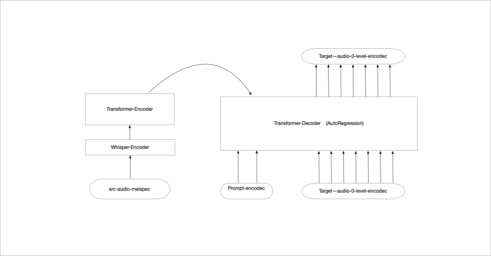

# vc-lm
[**中文**](./README.md) | [**English**](./README_en.md)

vc-lm is a project that can transform anyone's voice into thousands of different voices in audio.

## 🔄 What‘s new
* [2023/06/09] Support Any-to-One voice conversion model.

## Algorithm Architecture
This project references the paper [Vall-E](https://arxiv.org/abs/2301.02111)

It uses [encodec](https://github.com/facebookresearch/encodec)
to discretize audio into tokens and build a transformer language model on tokens. The project consists of two-stage models: AR model and NAR model.

Input: 3-second voice prompt audio + voice to be transformed

Output: Transformed audio

During the training phase, a self-supervised approach is used where the source audio and target audio are the same.
### AR Stage
Input: Prompt audio + source audio

Output: Target audio with 0-level tokens



### NAR Stage
Input: Target audio with 0 to k-level tokens

Output: Target audio with k+1 level tokens


## Dataset Construction

```
# All WAV files are first processed into files with a length of 10 to 24 seconds. Reference to[[tools/construct_wavs_file.py]
python tools/construct_dataset.py
```
## Convert Whisper Encoder Model

```
python tools/extract_whisper_encoder_model.py --input_model=../whisper/medium.pt --output_model=../whisper-encoder/medium-encoder.pt
```
## Training
```
bash ./sh/train_ar_model.sh
bash ./sh/train_nar_model.sh
```
## Inference
```
from vc_lm.vc_engine import VCEngine
engine = VCEngine('/root/autodl-tmp/vc-models/ar.ckpt',
                  '/root/autodl-tmp/vc-models/nar.ckpt',
                  '/root/project/vc-lm/configs/ar_model.json',
                  '/root/project/vc-lm/configs/nar_model.json')
output_wav = engine.process_audio(content_wav,
                                  style_wav, max_style_len=3, use_ar=True)           
```

## Models
The models were trained on the Wenetspeech dataset, which consists of thousands of hours of audio data, including the AR model and NAR model.

Model download link:

Link: https://pan.baidu.com/s/1bJUXrSH7tJ1QLPTv3tZzRQ
Extract code: 4kao

## Examples
[Input Audio](res/test-in.wav)

[Output Audio 1](res/o1.wav)

[Output Audio 2](res/o2.wav)

[Output Audio 3](res/o3.wav)

[Output Audio 4](res/o4.wav)

[Output Audio 5](res/o5.wav)

---
```
This project's models can generate a large number of one-to-any parallel data (i.e., any-to-one). These parallel data can be used to train any-to-one voice conversion models.
```
## Training Any-to-One VC Model
The target speaker's data achieves excellent results in just 10 minutes.

### Constructing Any-to-One Parallel Data
```
# Construct train, val, test data
python tools.construct_parallel_dataset.py
```
### Training
Load the pre-trained model mentioned above and train it on the specified speaker's data.
```
bash ./sh/train_finetune_ar_model.sh
bash ./sh/train_finetune_nar_model.sh
```

### Inference
```
from vc_lm.vc_engine import VCEngine
engine = VCEngine('/root/autodl-tmp/vc-models/jr-ar.ckpt',
                  '/root/autodl-tmp/vc-models/jr-nar.ckpt',
                  '/root/project/vc-lm/configs/ar_model.json',
                  '/root/project/vc-lm/configs/nar_model.json')
output_wav = engine.process_audio(content_wav,
                                  style_wav, max_style_len=3, use_ar=True)           
```
